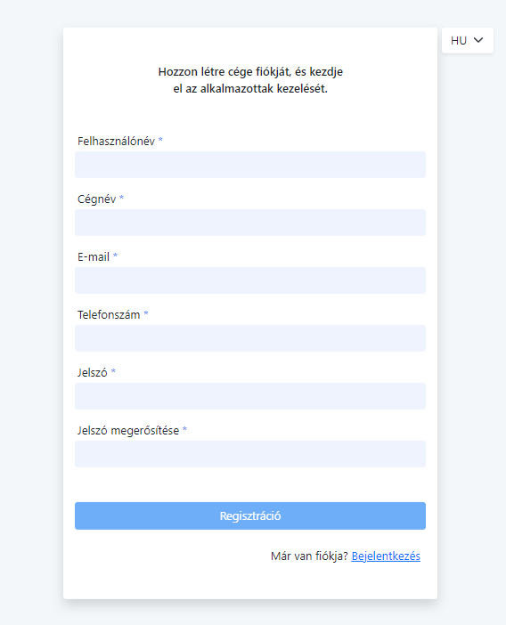
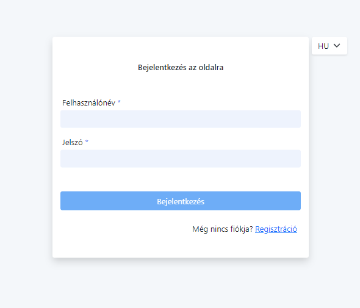
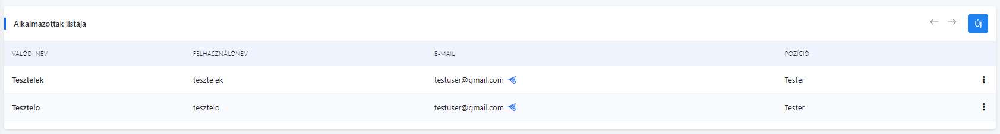
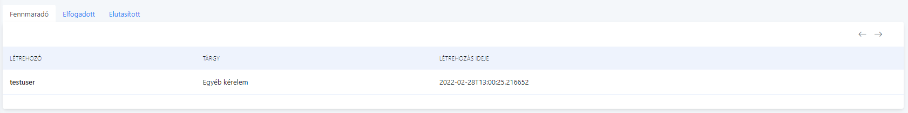
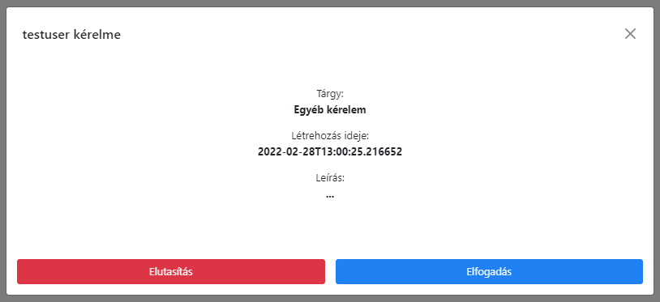
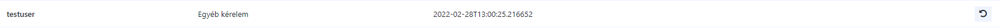
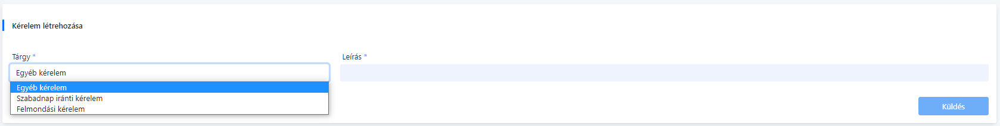
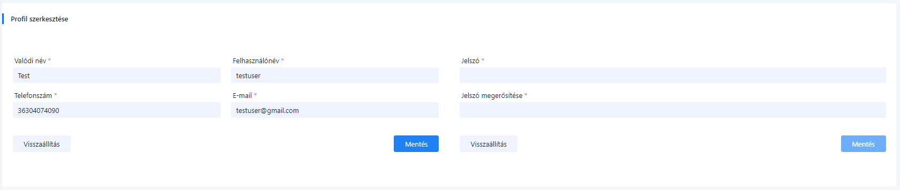
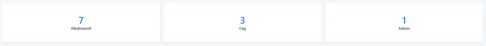
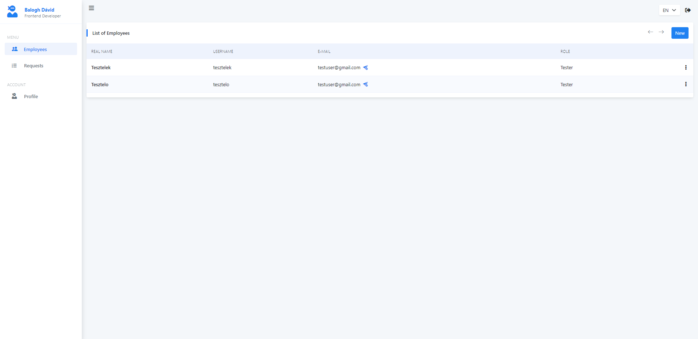

# Alkalmazott Menedzsment Rendszer

A program egy kezdetleges alkalmazott menedzsment weboldalt reprezentál, amely több fő funkciót lát el.

**1. Felhasználók kezelése** \
A weboldal használatához szükség van egy fiók létrehozására.
Fiókot a cége számára hozhat létre, majd ezt követően létrehozhat alkalmazotti fiókokot az alkalmazottak számára.
A fiók létrehozásához a következő mezők kitöltése szükséges:

  - Felhasználónév,
  - Cégnév,
  - E-mail cím,
  - Telefonszám,
  - Jelszó,
  - Jelszó megerősítése

A fiók elkészítése után a felhasználó automatikusan átkerül a bejelentkezői felületre, 
ahol a következő adatokat kell megadni a bejelentkezéshez:

  - Felhasználónév,
  - Jelszó

Alapvetően háromféle fióktípus van:

  - Admin, (Nem regisztrálható típus)
  - Cég, (Regisztrációs típus)
  - Alkalmazott (Cég által regisztrálható típus)

**2. Alkalmazottak listázása** \
Az alkalmazottak listázása jogosultsághoz igazódva történik és lopozószerűen.

  - Admin - (Összes regisztrált cég / azok alkalmazottai megjelennek a listában),
  - Cég - (Csak a céghez regisztrált alkalmazottak jelennek meg a listában),
  - Alkalmazott - (Annak a cégnek az alkalmazottai jelennek meg a listában, ahová csatolva van.)

A listában van lehetőségünk alkalmazotti fiók törlésére/szerkesztésére és új fiók felvételére.
Ezek a műveletek alkalmazotti fiókkal nem végezhetőek.

**3. Kérelmek listázása** \
A kérelmek listázása jogosultsághoz igazódva történik, illetve típus alapján csoportosítottak és lapozószerűen.

Jelenleg elérhető típusok:
  - Fennmaradó,
  - Elfogadott,
  - Elutasított
  
Megjelenítésük:
  - Admin - (Összes valaha benyújtott kérelem),
  - Cég - (Alkalmazottai által benyújtott kérelmek),
  - Alkalmazott - (Saját kérelmek)

Admin/Cég esetén a lista tartalmaz további két funkciót:

1. Fennmaradó kérelmek listázásánál elfogadható/elutasítható a kérelem.

2. Elfogadott/Elutasított kérelmek listázásánál visszavonható funkció, ami után a kérelem visszakerül a fennmaradóak közé. 

Alkalmazott esetén van lehetőségünk kérelem felvételére, amelyhez a következő mezők kitöltése szükséges:

  - Tárgy kiválasztása, ami lehet:
    - Egyéb kérelem,
    - Szabadnap iránti kérelem,
    - Felmondási kérelem
  - Kérelem indoklása

**3. A fiókhoz tartozó adatok módosítása** \
A felhasználó módosíthatja a jelszavát / fiók adatait. 

**4. Adminok részére regisztrált adatok kimutatása**  \
Kártyaszerű elrendezésben látható hány regisztrált tag van egy adott jogosultsági csoportba.

**5. Nyelvesítés** \
Az oldal jelenleg két nyelven elérhető, amelyek a következőek:

  - Angol,
  - Magyar

**6. Jogosultság kezelés** \
Egyes funckiók és menüpontok egy minimum jogosultsági szinttel érhetőek csak el.

  - Dashboard menüpont - (Adminok részére)
  - Alkalmazottak szerkesztése/törlése/felvétele - (Adminok részére, illetve cégek saját alkalmazottaik részére.)
  - Kérelem felvétele - (Alkalmazottak számára.)
  - Kérlem elbírálása - (Adminok részére, illetve cégek saját alkalmazottaik részére.)

**Az oldal összképében:**

# A program használatához szükséges programok
A program futtatásához a következőre van szükségünk:

  - `npm` ajánlott verzió `8.1.2`,
  - `nodejs` ajánlott verzió `16.13.2` [Nodejs letöltése](https://nodejs.org/en/)
  - `Angular CLI` ajánlott verzió `12.2.4` [Angular CLI telepítési utmutató](https://angular.io/cli)

# Használati útmutató
A fent említett `npm` sikeres telepítése után a következő command line parancsot kell kiadni a projekt fő mappájában: `npm install`

A futtatáshoz szükséges command line parancs: `ng serve`, amelyet a projekt fő mappájában kell kiadni.

A folyamatok elvégzése után a következő oldalon érhető el a weboldal: `http://localhost:4200/auth/login`

# Felhasznált technológiák

  - Angular 12,
  - Bootstrap 5,
  - Npm 8.1.2,
  - TypeScript 4.3.5,
  - HTML5,
  - SCSS,

